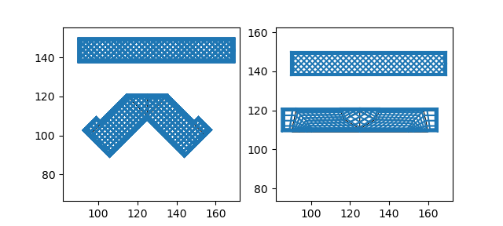

# gtrans

A python library and some example scripts (to be gradually added) for manipulating 3D printer gcode files using geometrical transformations.
The main goal was to enable graded infill structures using any slicing software.
The principle is based on the work of [Wüthrich et al.](https://dx.doi.org/10.1007/978-3-030-54334-1_10) who used gcode transformations for support-less printing.

`gtrans` uses the transformations to create infill structures with non-uniform density and anisotropy.
The definitions of the geometrical transformations may be either analytical or based on a finite-element mesh with prescribed displacements at nodes.

## Usage

The typical usage is:

1. Prepare the final geometry of a part to be printed

2. Define the displacement field, most probably as a `vtk` file.
   The FE mesh may or may not agree with the geometry of the part.
   
3. Create an `stl` file that contains the geometry transformed by the displacement field.

4. Use any slicing software to create a `gcode` on the transformed geometry.

5. Use the `gtrans.py` script to transform this `gcode` back onto the undeformed geometry.

For example, with example `02_bending`:

```
$ python examples/02_bending/v02_beam.py
```
	
This creates the files `v02_beam_2D.vtk`, `v02_beam_3D.vtk`, and `v02_beam_3D.stl` in the `examples/02_bending` directory.
Then you slice the `v02_beam_3D.stl` producing, say, `v02_beam_orig.gcode`.

After that, you apply the `gtrans.py` script:

```
$ python gtrans.py \
--offset 125 119.75 0 \
examples/02_bending/v02_beam_orig.gcode \
examples/02_bending/v02_beam_2D.vtk \
examples/02_bending/v02_beam_transformed.gcode
```

The `--offset` option is used to align the `vtk` FE mesh to the `gcode` generated by the slicer, since the model will most probably be translated to the center of the buildplate.

The following figure is the graphical output of the above example.
The left part shows the gcode generated by the slicer, the right one shows the transformed gcode.
One of the objects is the one generated by the example, while the other has been added manually in the slicer outside the FE mesh.
This way, only one of the objects is affected by the transformation.



## Code structure

The code consists of the following:

* `gtrans.py` - main script for transforming a uniform `gcode`

* `gcode.py` - module for working with the `gcode` instructions

* `femfun.py` - module for representing the geometric transformations using piecewise linear finite-element functions

* `geo.py` - simple geometry-related tools

* `examples` - showcase of different ways of using the tool

## Requirements

Most of the code uses [numpy](https://www.numpy.org), [scipy](https://www.scipy.org), [matplotlib](https://www.matplotlib.org), and [meshio](https://github.com/nschloe/meshio).
Some of the examples may use the [SfePy](https://www.sfepy.org) finite-element library.

## Roadmap

The following is planned to add/resolve in near future:

* Finish support of 3D elements (hexa, tetra)

* Add examples

* Add transformation of `stl` files for use with resin printers

* Fix the behavior of hexagonal and similar infill patterns, where some parts of the extrusion lines need to bond together.
  This might also change the way of dealing with perimeters.
